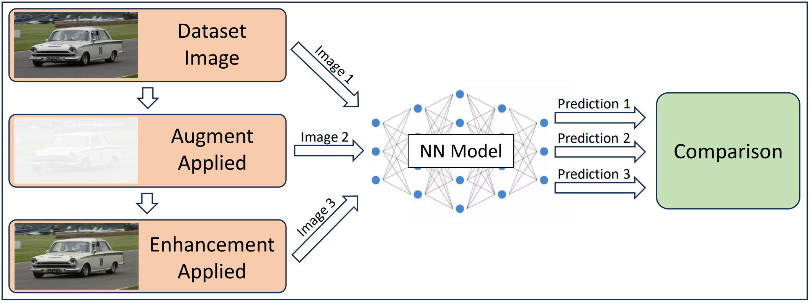

# FIND
FIND: Framework for evaluating Image enhancements on Neural networks inferencing in aDverse environments

------

## Overview
The goal of this project is to test and evaluate using image enhancements to improve adverse environments before being inferenced on by Neural Networks (NNs). A general overview of this methodology is shown below.



This framework utilizes PyTorch, Torch Lightning, Torch Vision, Utralytics YOLO, OpenCV, and a fork of [muggledy/retinex](https://github.com/muggledy/retinex)

## Currently Tested

#### Image Enhancements:
- Histogram Equalization (Original Algorithm)
- Retinex (SSR)

#### Environments:
- Dark
- Overexposed
- Hazy
- Dark & Rainy

#### Models:
- ResNet 18, 50, 101
- GoogleNet (Inception v1)
- YOLOv5s, YOLOv5m, YOLOv8n, YOLOv8m
- Vit (ViT-B_16)

#### Datasets:
- ImageNet
- COCO 2017

## Additionally Supported (Not Tested) Functionality

#### Image Enhancements:
- Retinex
    + MSR
    + MSRCP
    + GIMP
    + MSRCR
    + AMSR

#### Environments:
- Blur
- Histogram Remapping - very experimental
- Distibution Remapping - very experimental

#### Models:
- Nearly any model from Torch Vision Model Zoo
- Most YOLO models from Ultralytics YOLO

------

## Getting Started
First create a python virtual environment (not required but recommended) and source it
```bash
python3 -m venv venv
source venv/bin/activate
```

Clone the repo
```bash
git clone https://github.com/jjsuperpower/retinex.git
```

Next, get and initialize submodules
```bash
git submodule update --init --recursive
```

Install the requirements
```bash
pip install -r requirements.txt
```

If you plan to use jupyter notebooks run tests, you need to make sure it is installed. If you have not installed it, you can install it with
```bash
pip3 install notebook
```

You can test if everything is setup correctly by running an example jupyter notebook.
```bash
jupyter notebook examples/test_resnet18.ipynb
```

----

## List of files
```
📦FIND
 ┣ 📂doc - Photos used for documentation
 ┣ 📂examples   - Nearly all the examples are identical but just test different models
 ┣ 📂retinex    - Created by git submodule init
 ┣ 📂src        - Location source code
 ┃ ┣ 📜coco_ds.py           - Wrapper for COCO dataset
 ┃ ┣ 📜mymodels.py          - Contains torch lightning wrapper, and preprocessing builder for using multiple transforms
 ┃ ┣ 📜myutils.py           - Functions for displaying image data
 ┃ ┣ 📜transforms.py        - Where custom transforms are defined
 ┃ ┗ 📜yolo_wrapper.py      - Wrapper for Ultralytics YOLO
 ┣ 📂testing            - Random stuff, and some ideas not fully explored
 ┃ ┣ 📜cb_remap.ipynb       - Remap an image brightness and contrast to match another images brightness and contrast
 ┃ ┣ 📜gen_poster_img.py    - Used to generate images for poster, see doc/poster.pdf
 ┃ ┗ 📜hist_remap.ipynb     - Remap an image histogram to match another images histogram
 ┣ 📜README.md           - This file    
 ┗ 📜requirements.txt    - Dependencies
```

